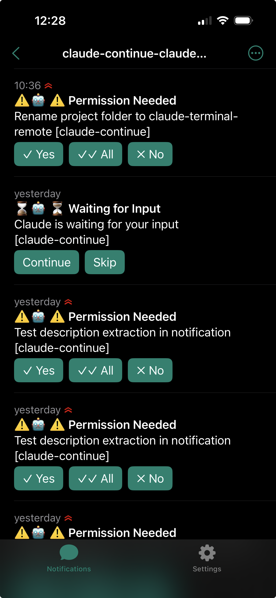
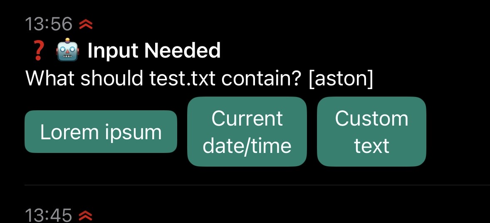
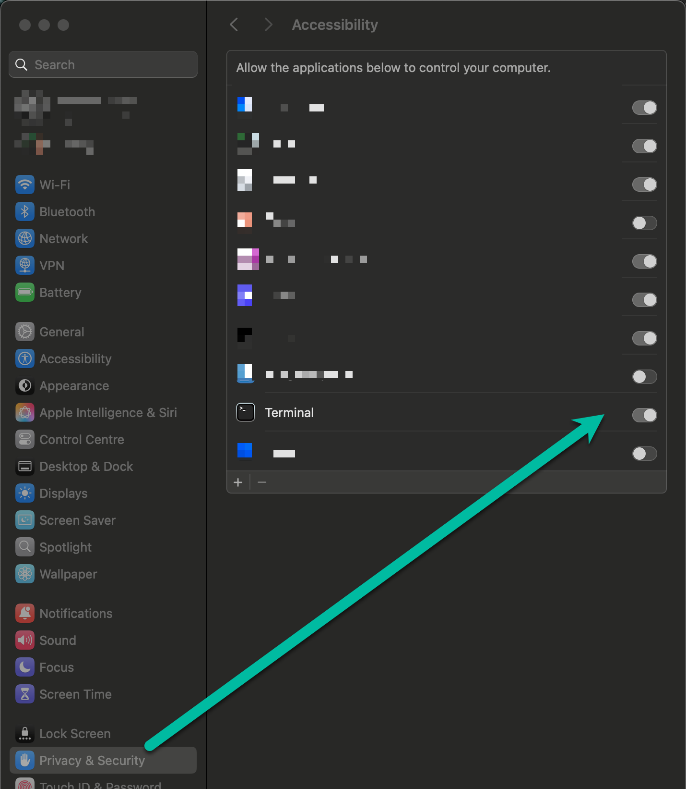

# Claude Terminal Remote

When you have multiple long-running Claude Code sessions on your Mac, they eventually stop and ask for permission to proceed. This utility allows you to approve them from your mobile phone using the [ntfy](https://ntfy.sh) app.

Alternative projects (probably less hacky): https://teleportation.dev/



### Input Dialogs

When Claude asks questions with multiple options, you get labeled buttons on your phone:

<p>


</p>

**An add-on for [ntfy](https://ntfy.sh)** - the simple HTTP-based pub-sub notification service by [Philipp C. Heckel](https://github.com/binwiederhier).

> **Note:** This is a quick-hack utility project. It works well for my workflow but isn't polished production software. Use it as a starting point and adapt to your needs.

## How It Works

When Claude Code is waiting for input (permission prompts, idle prompts), you get a push notification on your phone with action buttons. Tap a button, and the response is sent directly to the correct Terminal tab - even with multiple sessions running.

## Dependencies

This implementation uses:

- **[Supabase](https://supabase.com)** as a simple message queue between your phone and Mac. Their [free tier](https://supabase.com/pricing) is more than sufficient for this use case.

- **[n8n](https://n8n.io)** for the webhook that receives button taps and writes to Supabase. I use n8n in my stack, but this could easily be replaced with any webhook endpoint - a simple Cloudflare Worker, Vercel Edge Function, or any serverless function would work.

## Architecture

```
┌─────────────────────────────────────────────────────────────────┐
│  iOS/Android                                                    │
│  ┌──────────┐                                                   │
│  │   ntfy   │ ← Push notification with action buttons           │
│  └────┬─────┘                                                   │
│       │ tap                                                     │
└───────┼─────────────────────────────────────────────────────────┘
        │ HTTP POST (with ?action=1&tty=ttys003)
        ▼
┌───────────────┐     ┌──────────────────┐     ┌─────────────────┐
│ n8n Webhook   │────▶│ Supabase         │◀────│ Local Poller    │
│               │     │ claude_signals   │     │ (launchd)       │
└───────────────┘     │ (action + tty)   │     └────────┬────────┘
                      └──────────────────┘              │ AppleScript
                                                        │ (finds tab by TTY)
                                                        ▼
                                               ┌─────────────────┐
                                               │ Terminal.app    │
                                               │ correct tab     │
                                               └─────────────────┘
```

## Requirements

- **macOS** with Terminal.app
- **[ntfy](https://ntfy.sh)** app on iOS or Android
- **jq** installed (`brew install jq`)

## Quick Start

### 1. Create Supabase Table

In your Supabase project, create a table called `claude_signals`:

```sql
CREATE TABLE claude_signals (
  id UUID DEFAULT gen_random_uuid() PRIMARY KEY,
  action TEXT NOT NULL,
  tty TEXT,
  created_at TIMESTAMPTZ DEFAULT now()
);

-- Enable Row Level Security
ALTER TABLE claude_signals ENABLE ROW LEVEL SECURITY;

-- Allow anonymous inserts, deletes, and selects
CREATE POLICY "Allow anonymous insert" ON claude_signals FOR INSERT WITH CHECK (true);
CREATE POLICY "Allow anonymous delete" ON claude_signals FOR DELETE USING (true);
CREATE POLICY "Allow anonymous select" ON claude_signals FOR SELECT USING (true);
```

### 2. Configure Environment

Create `~/.claude-terminal-remote.env`:

```bash
# Supabase credentials (from Project Settings > API)
CLAUDE_TERMINAL_SUPABASE_URL="https://YOUR_PROJECT.supabase.co"
CLAUDE_TERMINAL_SUPABASE_KEY="your-anon-key"

# Your n8n webhook URL (after importing workflow)
CLAUDE_TERMINAL_WEBHOOK_URL="https://your-n8n.com/webhook/claude-terminal-remote"

# Unique topic suffix - generate with: openssl rand -hex 4
CLAUDE_TERMINAL_TOPIC_SUFFIX="your-unique-suffix"

# Notification delay in seconds (default: 60)
# Prevents spam when actively working - only notifies if you've stepped away
CLAUDE_TERMINAL_NOTIFY_DELAY="60"
```

### 3. Import n8n Workflow

1. Import `n8n-workflow.json` into your n8n instance
2. Update the HTTP Request node with your Supabase URL and anon key
3. Activate the workflow
4. Copy the webhook URL to your env file

### 4. Install Hook

Copy the hook script to Claude Code's hooks directory:

```bash
mkdir -p ~/.claude/hooks
cp ntfy-notify-hook.sh ~/.claude/hooks/ntfy-notify.sh
chmod +x ~/.claude/hooks/ntfy-notify.sh
```

Add to `~/.claude/settings.json`:

```json
{
  "hooks": {
    "Notification": [
      {
        "command": "~/.claude/hooks/ntfy-notify.sh"
      }
    ]
  }
}
```

### 5. Install Poller

Copy and make executable:

```bash
mkdir -p ~/.claude
cp poller.sh ~/.claude/poller.sh
chmod +x ~/.claude/poller.sh
```

Install the launchd service:

```bash
# First, edit the plist to replace YOUR_USERNAME with your actual username
# Open com.claude.terminal-remote.plist and replace all instances of YOUR_USERNAME
sed "s/YOUR_USERNAME/$(whoami)/g" com.claude.terminal-remote.plist > ~/Library/LaunchAgents/com.claude.terminal-remote.plist
launchctl load ~/Library/LaunchAgents/com.claude.terminal-remote.plist
```

### 6. Enable Accessibility

Terminal.app needs accessibility permissions to receive keystrokes:

1. System Settings → Privacy & Security → Accessibility
2. Enable Terminal.app



### 7. Subscribe to ntfy Topics

In the ntfy app, subscribe to your project topics:

```
{project-name}-claude-{your-topic-suffix}
```

For example, if working on a project called "myapp" with suffix "abc123":
- Subscribe to: `myapp-claude-abc123`

## Action Buttons

**Permission prompts** (3 buttons):
| Button | Action | Maps to |
|--------|--------|---------|
| Yes | `1` | Approve once |
| All | `2` | Approve all this session |
| No | `Escape` | Decline |

**Idle prompts** (2 buttons):
| Button | Action |
|--------|--------|
| Continue | `y` |
| Skip | `skip` |

**Input dialogs** (dynamic buttons):
| Button | Action |
|--------|--------|
| Option labels from Claude | `1`, `2`, `3` |

Input dialogs show the actual option text as button labels. Options containing "Type" or "Other" (free-text input) are filtered out since they require manual response.

## Topic Naming Convention

Topics are dynamically generated based on project directory:

```
{project}-claude-{suffix}
```

Examples:
- `/Users/you/dev/myproject` → `myproject-claude-abc123`
- `/Users/you/work/webapp` → `webapp-claude-abc123`
- Worktrees resolve to parent: `/Users/you/dev/myproject/.trees/feature-x` → `myproject-claude-abc123`

## Files

```
claude-terminal-remote/
├── README.md                         # This file
├── LICENSE                           # MIT License
├── .env.example                      # Environment template
├── poller.sh                         # Polls Supabase, sends keystrokes
├── ntfy-notify-hook.sh               # Claude Code notification hook
├── n8n-workflow.json                 # n8n workflow for import
├── com.claude.terminal-remote.plist  # launchd service config
├── claude-terminal-remote.png        # Hero image
├── accessibility-setup.png           # Screenshot of required permissions
├── claude-asks.png                   # Terminal showing input dialog
└── ntfy-provides-options.jpg         # ntfy app showing labeled buttons
```

## Commands

```bash
# View poller logs
tail -f ~/Library/Logs/claude-terminal-remote.log

# Restart poller
launchctl kickstart -k gui/$(id -u)/com.claude.terminal-remote

# Stop poller
launchctl unload ~/Library/LaunchAgents/com.claude.terminal-remote.plist

# Start poller
launchctl load ~/Library/LaunchAgents/com.claude.terminal-remote.plist

# Check if running
launchctl list | grep claude.terminal-remote
```

## Troubleshooting

**Poller not sending keystrokes:**
1. Check Accessibility permission: System Settings → Privacy & Security → Accessibility → Enable Terminal
2. Check logs: `tail -f ~/Library/Logs/claude-terminal-remote.log`
3. Verify env file exists: `cat ~/.claude-terminal-remote.env`

**n8n webhook not receiving:**
1. Verify workflow is ACTIVE in n8n UI
2. Check webhook URL in your env file
3. Test webhook directly: `curl -X POST "YOUR_WEBHOOK_URL?action=test"`

**ntfy not showing buttons:**
1. Ensure you're subscribed to the correct topic
2. Check your topic suffix matches your env file
3. Verify WEBHOOK_URL is set in your env file

## Credits

This project exists thanks to:

- **[Andrew Ford](https://github.com/andrewjamesford)** - His blog post [Claude Code instant notifications with ntfy](https://andrewford.co.nz/articles/claude-code-instant-notifications-ntfy/) introduced me to using ntfy with Claude Code. This project extends his idea with action buttons and multi-session TTY routing.

- **[ntfy](https://ntfy.sh)** by [Philipp C. Heckel](https://github.com/binwiederhier) - The simple, brilliant HTTP-based pub-sub notification service that makes this all possible.

- **[Claude](https://claude.ai)** by [Anthropic](https://anthropic.com) - This entire implementation was built collaboratively with Claude Code. Meta, I know.

## License

MIT License - see [LICENSE](LICENSE)
